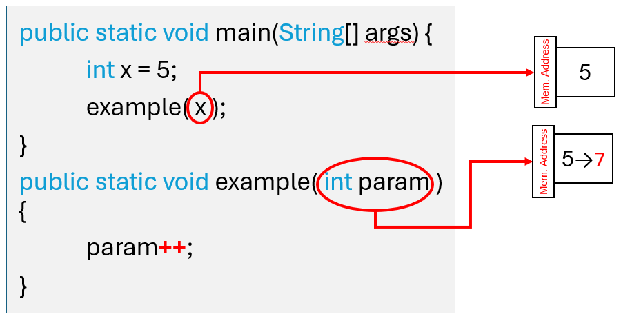
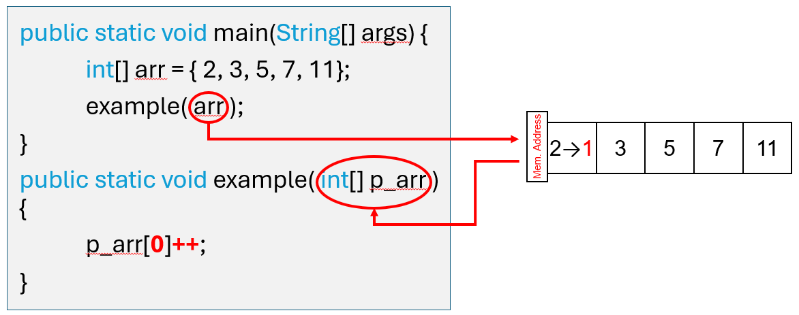
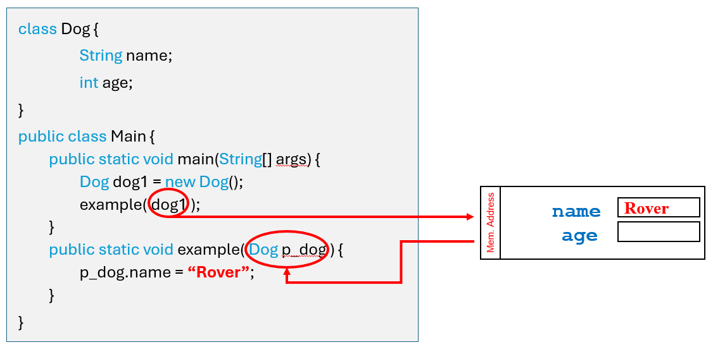

# Lab Assignment 15

In this lab you will practice working with pass-by-reference parameters.

Unlike previous labs, your class has already been created for you. 

## Let's get started!

For this lab your **main() method** is in the Main class. For this lab you can create new classes inside the Main.java file or create a new file in the **src/** directory.

Now let's begin!

## Pass-By-Copy

In Java, when passing variables from functions they are always `passed-by-copy`. What does this mean?

When a variable is passed-by-copy, a copy of the literal (a primitive data type value ex: "ab", 3.2f, 5, true) stored inside the original variable is made and stored into a **new variable**.

For example, look at the image below and see how variable `x` is passed to the function `example()` and received by the parameter variable `param`. Now, `param` and `x` are two seperate variables, this is because only a copy of the literal `5` stored inside `x` was passed into the **new variable** `param`.

**Passing Variables:**



## Pass-By-Reference

However, there are excemptions to passing-by-copy. When dealing with large data structures like arrays and objects it's inconvenient for Java to make copies of them, since this would waste a lot of memory. Instead, arrays and objects are `passed-by-reference`. What does this mean?

When something is passed-by-reference, the memory location of the original element is given and is then assigned a new alias or identifier. Thus, <ins>no new element was created</ins>.

For example, look at the image below and see how array `arr` is passed into function `example()` and received by the parameter array `p_arr`. Now, `arr` and `p_arr` are the same array, this is because the memory location of `arr` was assigned to `p_arr`. This means they are linked and modifying `p_arr` will modify `arr`.

**Passing Arrays:**



**Passing Objects:**



## Your Program

### Increment by One

For this assignment you will practice working with **pass-by-copy** and **pass-by-reference** parameters.

Frist let's create a seperate class to test our objects. Create a class `Dog` with a **public** attribute `age`. 

Now inside `Main`, create three **void** methods `incrementVar()`, `incrementArr()`, and `incrementObj()`. Give each method a single parameter, `incrementVar()`'s parameter should be type **int**, `incrementArr()`'s parameter should be type **int[]**, and `incrementObj()`'s parameter should be type **Dog**. Each method should **increment the value in their parameter by one**. For `incrementArr()` increment all the array values by one and for `incrementObj()` increment `age` by one.

Now test your methods, inside the `main()` method declare and initialize (assign a values) an integer variable, an integer array, and a Dog object and pass them into their respective methods. Lastly, print out the variable, array, and object attribute to see which were passed-by-copy and which were passed-by-reference.

No output is required for this lab, but you can test your solution by running the commands below in your terminal.

```
./build.sh
./test.sh
```

## Submit your assignment

To submit your lab assignment click on the source control icon (3 circles with 2 lines) on your leftside navbar. Next, click on the '+' symbol next to "Changes" to stage your changes. Lastly, add a commit message (ex: "First commit") and click "Commit" then "Push" or "Sync Changes". And you're done!
